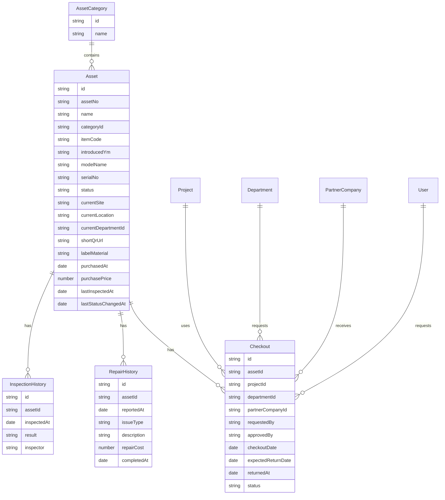

# 회사 자산·비품 통합관리 Dashboard 구축 제안서

## 수정 히스토리 및 변경 안

### 1. Naming Rule (자산 번호 체계)

개정 사유: 잦은 부서 이동 및 재배치 시 자산 번호가 변경되는 관리 비효율을 방지하고, 자산 번호 불변의 원칙을 확립하기 위함이다.

변경 전 자산 번호 조합:

`[사업장]-[상세위치]-[자산구분]-[품목]-[연도]-[순번]`

예시: `OF-OS01-ADM-DESK-26-001`

변경 후 자산 번호 조합:

`[자산구분]-[품목]-[도입연월]-[순번]`

예시: `ADM-DESK-2605-001` (일반비품-책상-2026년 5월-001번)

자산 번호는 최초 부여 후 폐기 시까지 변경되지 않는 고유 식별자로만 사용한다. 사업장, 상세위치, 사용부서 등 변동 가능한 정보는 자산 번호와 스티커 번호에 포함하지 않으며, 사내 자산관리 시스템의 상태 값과 이력 데이터로만 업데이트하고 관리한다.

### 2. 자산 생애주기(Lifecycle) 및 정기 실사 절차

신규 등록뿐만 아니라 이동, 대여, 반납, 폐기, 정기 재물조사까지 포함해 전체 생애주기를 관리한다. 이동이나 부서 재배치가 발생해도 자산 번호는 변경하지 않고, QR 스캔 후 시스템의 위치, 사용자, 사용부서, 상태 값만 갱신한다.

정기 재물조사는 연 1회 또는 반기 1회 실시한다. 각 부서 자산 담당자는 모바일 기기로 할당 자산의 QR 코드를 스캔하여 실제 위치와 상태를 시스템 데이터와 대조하고 Check-in 처리한다. 미스캔 자산은 분실 또는 미사용 가능성이 있는 자산으로 분류해 별도 소명 절차를 진행한다.

### 3. 스티커 재질 및 보안 기준

일반 비품은 기존과 같이 무광 PET 라벨을 사용한다. 노트북, 모니터, 고가 장비 등 IT 기기 및 고가 장비는 파괴 라벨(Tamper-evident label) 또는 VOID 라벨을 적용한다. 임의 제거 시 기기 표면에 `VOID` 문구가 남거나 스티커가 조각나 훼손 여부를 육안으로 즉시 확인할 수 있어야 한다.

### 4. QR 코드 값(URL) 및 보안 최적화

QR 코드 데이터는 전체 URL 대신 단축 URL을 적용한다. 예: `https://cmp.ny/A123`. 문자열 길이를 줄여 40x25mm 소형 스티커에서도 스마트폰 카메라 인식률을 높인다.

QR 코드가 연결하는 자산 상세 정보 페이지는 사내 시스템(SSO 등) 로그인 후 인가된 임직원만 열람할 수 있어야 한다. 외부인이 스캔할 경우 내부 자산 정보는 노출하지 않고 "접근 권한이 없습니다" 안내 페이지만 표시한다.

## 1. 제안 개요

회사의 장비, 공구, 비품, 생산 지원 자산을 프로젝트와 사업부 단위로 체계적으로 관리하기 위한 통합 Dashboard 시스템을 제안한다.

본 시스템은 장비의 보유 현황, 반출, 지급, 반납, 수리 이력, 활용률, 미반납 현황을 한 화면에서 확인하고, 생산팀과 사업부, 사내 협력업체가 사용하는 장비의 책임 소재와 사용 이력을 명확하게 관리하는 것을 목표로 한다.

핵심은 단순한 자산 목록 관리가 아니라, 장비가 언제, 누구에게, 어떤 프로젝트 목적으로 지급되었고, 현재 사용 가능한지, 수리나 교체가 필요한지까지 연결해서 보는 운영형 자산관리 체계이다.

## 2. 추진 배경

현재 장비와 비품 관리는 엑셀, 구두 요청, 수기 대장, 현장 확인에 의존하기 쉽다. 이 방식은 다음과 같은 문제를 만든다.

- 장비가 어느 팀이나 협력업체에 지급되었는지 즉시 확인하기 어렵다.
- 프로젝트 종료 후 반납 누락이 발생해도 늦게 발견된다.
- 동일 장비를 추가 구매하거나 불필요하게 임대하는 경우가 생긴다.
- 수리 이력과 고장 빈도가 정리되지 않아 교체 판단이 어렵다.
- 실제 활용률이 낮은 장비와 부족한 장비를 구분하기 어렵다.
- 생산팀, 사업부, 사내 협력업체 간 책임 소재가 불분명해진다.

따라서 장비의 생애주기 전체를 관리하는 Dashboard가 필요하다.

## 3. 구축 목표

1. 전사 장비 현황의 실시간 가시화
   - 보유, 사용 중, 반출 대기, 수리 중, 폐기 예정 상태를 한 화면에서 확인한다.

2. 반출과 반납 프로세스 표준화
   - 생산팀, 사업부, 사내 협력업체로 지급되는 장비를 승인 기반으로 관리한다.

3. 프로젝트별 장비 사용 이력 관리
   - 프로젝트 기간, 사용 부서, 사용자, 사용 목적을 장비 이력과 연결한다.

4. 장비 활용률과 유휴 장비 분석
   - 장비별, 부서별, 프로젝트별 사용률을 분석해 구매와 배치 의사결정을 지원한다.

5. 수리 이력과 비용 관리
   - 고장, 수리, 점검, 교체 주기를 누적 관리해 예방정비와 교체 판단을 가능하게 한다.

6. 미반납과 장기 점유 관리
   - 프로젝트 종료 후 반납되지 않은 장비를 자동으로 표시하고 담당자에게 알림을 보낸다.

## 4. 관리 대상 범위

관리 대상은 회사가 보유하고 현장, 생산팀, 협력업체에 지급되는 모든 물리 자산이다.

| 구분 | 예시 | 관리 포인트 |
|------|------|-------------|
| 생산 장비 | 용접기, 절단기, 측정기, 전동공구 | 반출, 반납, 수리, 점검 |
| 공용 공구 | 렌치, 드릴, 지그, 치공구 | 보관 위치, 지급 수량, 분실 |
| IT·사무 비품 | 노트북, 태블릿, 모니터, 프린터 | 사용자, 지급일, 회수일 |
| 안전 장비 | 안전벨트, 가스측정기, 보호구 | 유효기간, 점검 이력 |
| 임대·협력사 지급 장비 | 프로젝트성 지급 장비 | 계약 기간, 반납 책임 |

## 5. 표준 업무 프로세스

### 5.1 장비 등록

구매 또는 입고된 장비는 개정 Naming Rule에 따라 자산번호를 부여하고 기본 정보를 등록한다. 자산번호는 `[자산구분]-[품목]-[도입연월]-[순번]` 형식으로 생성하며, 최초 등록 후 폐기 시까지 변경하지 않는다.

필수 항목:

- 자산번호: 예 `ADM-DESK-2605-001`
- 장비명
- 분류
- 도입연월
- 제조사와 모델명
- 시리얼 번호
- 구매일
- 구매금액
- 보관 위치
- 관리 부서
- 현재 상태
- QR 또는 바코드 코드: 단축 URL 권장

사업장, 상세위치, 사용부서, 현재 사용자는 변동 가능한 운영 정보로 분리해 관리한다. 위치나 부서가 변경되어도 자산번호와 QR 스티커는 재발행하지 않고, 시스템의 상태 값과 이력만 갱신한다.

### 5.2 장비 요청

생산팀, 사업부, 사내 협력업체는 필요한 장비를 시스템에서 요청한다.

요청 항목:

- 요청 부서 또는 업체
- 요청자
- 프로젝트명
- 사용 기간
- 사용 장소
- 필요 장비와 수량
- 사용 목적

### 5.3 반출 승인

자산 담당자 또는 관리 부서는 요청 내용을 검토한 뒤 승인한다.

검토 기준:

- 해당 장비의 현재 상태
- 동일 기간 중복 사용 여부
- 프로젝트 종료 예정일
- 협력업체 지급 가능 여부
- 수리 또는 점검 필요 여부

### 5.4 장비 지급과 반출

승인된 장비는 생산팀, 사업부, 협력업체에 지급된다. 지급 시 QR 또는 바코드를 스캔해 반출 이력을 남긴다.

반출 기록:

- 반출일
- 수령자
- 소속 부서 또는 업체
- 프로젝트
- 반출 담당자
- 반출 전 상태 사진
- 예상 반납일

### 5.5 사용 중 관리

사용 중인 장비는 프로젝트와 연결되어 Dashboard에서 추적된다.

관리 항목:

- 현재 사용자
- 현재 위치
- 사용 기간
- 반납 예정일
- 연체 여부
- 사용 중 고장 신고
- 중간 점검 이력

### 5.6 반납

프로젝트 종료 후 장비를 반납하고 상태를 확인한다.

반납 기록:

- 실제 반납일
- 반납자
- 반납 접수자
- 반납 상태
- 파손 여부
- 사진 첨부
- 수리 필요 여부
- 다음 사용 가능 여부

### 5.7 수리와 점검

고장, 파손, 정기점검이 필요한 장비는 수리 상태로 전환한다.

수리 기록:

- 고장 접수일
- 고장 유형
- 증상
- 수리 업체
- 수리 비용
- 수리 기간
- 수리 완료일
- 재발 여부
- 교체 권고 여부

### 5.8 자산 상태 변경 (이동/대여/반납/폐기)

이동 또는 대여가 발생하면 사용 부서 또는 현장 담당자는 해당 자산의 QR 코드를 스캔하고, 시스템에서 위치, 사용자, 사용부서, 프로젝트, 상태 값을 즉시 갱신한다. 이때 자산번호는 변경하지 않으며 스티커 재발행도 하지 않는다.

반납 시에는 실제 반납일, 반납자, 반납 접수자, 반납 상태, 파손 여부, 사진, 수리 필요 여부를 저장한다. 사용 연한 만료 또는 파손으로 폐기할 때는 시스템 상태를 `폐기`로 변경하고, 부착된 QR 스티커는 물리적으로 훼손해 재사용을 방지한다.

### 5.9 정기 재물조사(실사)

정기 재물조사는 연 1회 또는 반기 1회 실시한다. 각 부서의 자산 담당자는 모바일 기기로 할당된 자산의 QR 코드를 스캔하여 실제 위치와 상태를 시스템 데이터와 대조하고 Check-in 처리한다.

미스캔 자산은 분실, 장기 미사용, 미등록 이동 가능성이 있는 자산으로 분류한다. 자산 담당자는 미스캔 목록을 기준으로 사용자 또는 관리부서에 소명을 요청하고, 확인 결과에 따라 위치 갱신, 회수, 폐기, 분실 처리 중 하나로 상태를 정리한다.

## 6. Dashboard 구성 제안

### 6.1 메인 Dashboard

메인 화면은 경영진, 자산 담당자, 생산관리팀이 가장 자주 확인하는 지표 중심으로 구성한다.

상단 KPI 카드:

- 전체 자산 수
- 사용 가능 장비 수
- 사용 중 장비 수
- 수리 중 장비 수
- 반납 지연 장비 수
- 월간 장비 활용률
- 월간 수리 비용
- 교체 검토 대상 장비 수

중앙 시각화:

- 장비 상태별 비율 차트
- 사업부별 장비 점유 현황
- 프로젝트별 장비 사용 현황
- 반납 예정 캘린더
- 수리 중 장비 목록

하단 알림 영역:

- 오늘 반납 예정 장비
- 반납 지연 장비
- 수리 완료 장비
- 장기 미사용 장비
- 점검 유효기간 만료 예정 장비

### 6.2 장비 목록 화면

장비 목록은 자산 담당자가 가장 많이 쓰는 작업 화면이다.

주요 기능:

- 장비명, 자산번호, 시리얼 번호 검색
- 분류, 상태, 보관 위치, 관리 부서 필터
- 사용 가능, 사용 중, 수리 중, 폐기 예정 상태 표시
- 현재 사용자와 프로젝트 표시
- 장비 상세 페이지 이동
- 엑셀 업로드와 다운로드
- 단축 URL 기반 QR 또는 바코드 출력
- 이동, 대여, 반납, 폐기 상태 변경
- 정기 실사 Check-in 및 미스캔 목록 확인

권장 컬럼:

| 컬럼 | 설명 |
|------|------|
| 자산번호 | 회사 내부 고유번호. 예: ADM-DESK-2605-001 |
| 장비명 | 장비 또는 비품명 |
| 분류 | 생산 장비, 공구, IT 비품 등 |
| 상태 | 사용 가능, 사용 중, 수리 중, 폐기 |
| 현재 위치 | 창고, 공장, 프로젝트 현장 |
| 현재 사용자 | 부서, 담당자, 협력업체 |
| 프로젝트 | 사용 중인 프로젝트 |
| 반납 예정일 | 현재 반출 건의 예정일 |
| 최근 수리일 | 마지막 수리 일자 |
| 활용률 | 최근 3개월 또는 12개월 기준 |

### 6.3 장비 상세 화면

각 장비의 생애주기를 한 화면에서 볼 수 있게 한다.

구성:

- 기본 정보
- 현재 상태
- 현재 사용 정보
- 반출·반납 이력
- 수리·점검 이력
- 사진과 첨부파일
- 구매 정보
- 감가상각 또는 교체 기준
- 누적 사용일수
- 누적 수리비
- 단축 QR URL
- 스티커 재질
- 최종 실사일과 최근 상태 변경일

의사결정 표시:

- 정상 사용
- 점검 필요
- 수리 반복
- 교체 검토
- 폐기 권고

### 6.4 반출·반납 관리 화면

반출과 반납 업무를 별도 메뉴로 분리해 현장 담당자가 빠르게 처리할 수 있게 한다.

기능:

- 반출 요청 목록
- 승인 대기 목록
- 오늘 반출 예정
- 오늘 반납 예정
- 반납 지연 목록
- QR 스캔 반출 처리
- QR 스캔 반납 처리
- 반납 상태 사진 등록

### 6.5 프로젝트별 장비 현황 화면

프로젝트별로 어떤 장비가 투입되어 있는지 확인한다.

표시 항목:

- 프로젝트명
- 사업부
- 생산관리 담당자
- 협력업체
- 투입 장비 수
- 사용 기간
- 반납 예정일
- 미반납 장비
- 고장 발생 장비

이 화면은 프로젝트 종료 시 반납 체크리스트로 활용할 수 있다.

### 6.6 협력업체 지급 현황 화면

사내 협력업체에 지급된 장비를 별도 관리한다.

관리 항목:

- 협력업체명
- 지급 장비 목록
- 지급일
- 반납 예정일
- 반납 지연 여부
- 파손 또는 분실 이력
- 업체별 누적 사용 건수
- 업체별 수리·파손 발생률

### 6.7 수리·점검 Dashboard

수리 이력은 구매와 교체 판단에 직접 연결되므로 별도 Dashboard로 관리한다.

주요 지표:

- 월별 수리 건수
- 월별 수리 비용
- 장비별 누적 수리 비용
- 고장 빈도 상위 장비
- 수리 기간 평균
- 점검 예정 장비
- 반복 고장 장비

교체 검토 기준 예시:

- 12개월 내 3회 이상 수리
- 누적 수리비가 구매금액의 50% 초과
- 동일 고장 유형 반복
- 수리 기간이 길어 생산 일정에 영향 발생

### 6.8 QR 스티커 및 보안 화면

자산번호와 QR 스티커는 실물 식별을 위한 고정 식별 수단으로 운영한다. 스티커에는 자산번호, 품명, QR 코드, 필요 시 스티커 크기와 회사명만 표기하고, 사업장, 상세위치, 사용부서처럼 자주 바뀌는 정보는 포함하지 않는다.

주요 기능:

- 자산별 단축 URL 생성: 예 `https://cmp.ny/A123`
- QR 스캔 시 사내 SSO 또는 권한 확인 후 상세 페이지 접근
- 외부 스캔 시 내부 정보 비노출 및 접근 권한 없음 안내
- 일반 비품은 무광 PET 라벨 적용
- IT 기기와 고가 장비는 VOID 라벨 또는 파괴 라벨 적용
- 인쇄업자 전달용 CSV 다운로드
- 샘플 스티커 검수 및 스캔 테스트 결과 기록

## 7. 권장 데이터 모델

## 8. 상태 체계

장비 상태는 모든 화면과 프로세스의 기준이므로 명확하게 정의해야 한다.

| 상태 | 의미 | 다음 가능 작업 |
|------|------|----------------|
| 사용 가능 | 창고 또는 보관 위치에 있으며 반출 가능 | 반출 요청, 수리 등록 |
| 승인 대기 | 반출 요청이 접수되어 승인 전 | 승인, 반려 |
| 사용 중 | 특정 부서, 프로젝트, 협력업체에 지급됨 | 이동, 반납, 고장 신고, 연장 요청 |
| 이동/대여 | 위치 또는 사용자 정보가 변경됨 | QR 스캔 후 위치/사용자 갱신 |
| 반납 | 사용 종료 후 보관 위치로 회수됨 | 상태 확인, 점검 필요, 사용 가능 전환 |
| 반납 지연 | 예정일이 지났지만 반납되지 않음 | 알림, 회수 요청 |
| 점검 필요 | 반납 후 확인 또는 정기점검 필요 | 점검 완료, 수리 전환 |
| 수리 중 | 고장 또는 파손으로 사용 불가 | 수리 완료, 폐기 검토 |
| 폐기 예정 | 사용 가치가 낮거나 교체 대상 | 폐기 승인 |
| 폐기 | 시스템 운영 자산에서 제외됨. QR 스티커 물리 훼손 필수 | 이력 조회만 가능 |

## 9. 사용자 권한

| 역할 | 주요 권한 |
|------|-----------|
| 관리자 | 전체 설정, 사용자 권한, 기준정보 관리 |
| 자산 담당자 | 장비 등록, 수정, 승인, 반출, 반납, 수리 관리 |
| 생산관리팀 | 장비 요청, 프로젝트별 사용 현황 확인, 반납 처리 |
| 사업부 담당자 | 자기 사업부 장비 요청과 사용 현황 확인 |
| 협력업체 담당자 | 지급 장비 확인, 반납 요청, 고장 신고 |
| 경영진 | Dashboard와 KPI 조회 |

권한 설계의 핵심은 협력업체가 회사 전체 자산 정보를 보지 못하게 하면서, 자신에게 지급된 장비와 반납 의무는 명확히 확인할 수 있게 하는 것이다.

## 10. 핵심 KPI

운영 Dashboard에서 관리해야 할 핵심 지표는 다음과 같다.

| KPI | 산식 또는 의미 |
|-----|----------------|
| 장비 활용률 | 사용 중 일수 ÷ 전체 기간 |
| 유휴 장비 수 | 최근 기준 기간 동안 사용 이력이 없는 장비 |
| 반납 준수율 | 정상 반납 건수 ÷ 전체 반납 대상 건수 |
| 반납 지연 건수 | 예정일 초과 후 미반납 상태 |
| 장비별 수리비 | 특정 장비의 누적 수리 비용 |
| 고장 빈도 | 장비별 고장 접수 횟수 |
| 프로젝트별 장비 투입량 | 프로젝트에 연결된 장비 수와 사용일 |
| 협력업체별 미반납률 | 업체별 지연 반납 건수 ÷ 지급 건수 |
| 교체 검토 대상 | 수리비, 고장 빈도, 사용 연한 기준 초과 장비 |

## 11. 알림과 자동화

시스템은 단순 조회를 넘어서 담당자에게 필요한 행동을 알려줘야 한다.

권장 알림:

- 반납 예정 3일 전 알림
- 반납 예정 당일 알림
- 반납 지연 발생 알림
- 수리 완료 알림
- 점검 유효기간 만료 예정 알림
- 장기 미사용 장비 알림
- 반복 고장 장비 알림
- 프로젝트 종료 시 장비 반납 체크리스트 자동 생성

알림 채널:

- 시스템 내 알림
- 이메일
- 카카오워크, Teams, Slack 등 사내 협업툴 연동
- 모바일 QR 스캔 화면

## 12. 화면 흐름 예시

## 13. 기존 공장 부하 관리 시스템과의 연계 방향

현재 FLAS 시스템은 공장, 구역, 프로젝트, 배치, 부하율을 관리한다. 자산관리 Dashboard를 확장 모듈로 추가하면 공장 공간과 장비 투입을 함께 볼 수 있다.

연계 예시:

- 프로젝트 등록 시 필요한 장비도 함께 배정
- 공장 구역별 투입 장비 현황 표시
- 프로젝트 종료 시 공간 해제와 장비 반납을 함께 체크
- 특정 구역에 사용 중인 장비 목록 조회
- 부하율이 높은 기간에 장비 부족 가능성 사전 탐지

이렇게 연결하면 "어느 공장 구역에 어떤 프로젝트가 들어가 있고, 그 프로젝트가 어떤 장비를 사용 중인지"까지 통합적으로 관리할 수 있다.

## 14. 단계별 구축안

### Phase 1. 자산 마스터와 반출·반납 기본 기능

기간: 4주 내외

구축 범위:

- 장비 마스터 등록
- 장비 목록과 상세 화면
- 부서, 협력업체, 프로젝트 기준정보
- 반출 요청
- 승인
- 반출 처리
- 반납 처리
- 기본 Dashboard
- 엑셀 업로드와 다운로드

성과:

- 현재 장비가 어디에 있는지 즉시 확인 가능
- 반납 지연 장비 관리 시작
- 수기 장부와 엑셀 의존도 감소

### Phase 2. 수리 이력과 활용률 분석

기간: 3주 내외

구축 범위:

- 수리·점검 이력 관리
- 고장 신고
- 수리 비용 관리
- 장비별 활용률 계산
- 반복 고장 장비 자동 표시
- 교체 검토 대상 표시

성과:

- 수리비와 고장 빈도 기반 교체 판단 가능
- 유휴 장비와 부족 장비 분석 가능

### Phase 3. QR·바코드 기반 현장 처리

기간: 3주 내외

구축 범위:

- QR 또는 바코드 발급
- 모바일 스캔 반출
- 모바일 스캔 반납
- 반출·반납 사진 첨부
- 현장용 간편 화면

성과:

- 현장 처리 속도 향상
- 장비 실물과 시스템 데이터 불일치 감소

### Phase 4. 경영 Dashboard와 예측 관리

기간: 4주 내외

구축 범위:

- 사업부별 활용률 Dashboard
- 프로젝트별 장비 투입 분석
- 협력업체별 미반납과 파손률 분석
- 월별 수리비 추이
- 구매·교체 추천
- PDF 리포트 출력

성과:

- 구매, 임대, 교체, 회수 의사결정 지원
- 경영진 보고 자동화

## 15. 운영 기준 제안

시스템 도입과 함께 다음 운영 기준을 정해야 한다.

1. 모든 장비는 자산번호와 QR 코드를 부여한다.
2. 장비 반출은 시스템 승인 후에만 가능하게 한다.
3. 협력업체 지급 장비는 담당 사업부와 업체 담당자를 함께 기록한다.
4. 프로젝트 종료 시 반납 체크리스트를 필수로 확인한다.
5. 반납 시 정상, 파손, 수리 필요 상태를 반드시 선택한다.
6. 고가 장비는 반출 전후 사진을 필수 첨부한다.
7. 반납 지연은 담당자와 상위 관리자에게 자동 알림을 보낸다.
8. 반복 고장 장비는 월 1회 교체 검토 회의 안건으로 자동 집계한다.

## 16. 기대 효과

- 장비 위치와 사용자 파악 시간 단축
- 반납 누락과 분실 감소
- 불필요한 신규 구매와 임대 비용 절감
- 프로젝트별 장비 투입 현황 명확화
- 협력업체 지급 장비의 책임 소재 강화
- 수리 이력 기반의 교체 판단 가능
- 경영진과 현장 모두가 같은 데이터를 보고 의사결정 가능

## 17. 우선 구현해야 할 핵심 화면

초기 버전에서는 아래 5개 화면을 우선 구현하는 것이 가장 효과적이다.

1. 자산 Dashboard
2. 장비 목록
3. 장비 상세
4. 반출·반납 관리
5. 프로젝트별 장비 현황

이 5개 화면이 완성되면 자산의 보유, 지급, 사용, 반납, 수리 흐름을 기본적으로 통제할 수 있다. 이후 협력업체 분석, QR 스캔, 경영 리포트 기능을 확장하면 된다.

## 18. 결론

자산·비품 관리 Dashboard는 장비 목록을 예쁘게 보여주는 시스템이 아니라, 생산 현장의 장비 흐름을 통제하고 비용을 줄이는 운영 시스템이어야 한다.

특히 생산팀, 사업부, 사내 협력업체에 장비가 지급되는 구조에서는 "누가, 언제, 어떤 프로젝트 때문에, 어떤 장비를 사용 중인지"가 가장 중요한 관리 기준이다. 여기에 반납 예정일, 수리 이력, 활용률, 미반납 알림을 연결하면 장비 관리가 사후 추적에서 사전 관리로 전환된다.

따라서 본 제안은 다음 방향으로 추진하는 것을 권장한다.

- 1단계는 자산 마스터와 반출·반납 흐름을 빠르게 구축한다.
- 2단계는 수리 이력과 활용률을 연결해 비용 관리로 확장한다.
- 3단계는 QR 기반 현장 처리를 도입해 데이터 정확도를 높인다.
- 4단계는 경영 Dashboard와 리포트로 의사결정 체계를 완성한다.

이 방식으로 구축하면 회사는 장비의 보유 현황뿐 아니라 실제 사용성과 비용, 책임 소재까지 관리할 수 있는 자산 운영 체계를 갖추게 된다.
